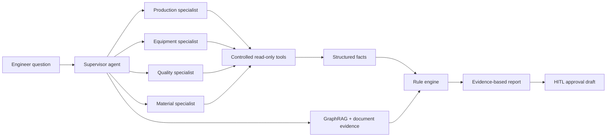

# ForgeOps Industrial Agent Demo

> A runnable, privacy-safe demo for manufacturing incident investigation. It demonstrates a **supervisor + four read-only specialist agents + GraphRAG evidence path + rule engine + human-in-the-loop approval** workflow.

[中文说明](#中文说明) · [English](#english)

## What an interviewer can see in 3 minutes

Paste an incident such as:

```text
设备 SN:DVT-24017 在真空调试时触发 ALM-217，请分析根因、影响范围和处置建议。
```

The UI renders an auditable investigation report with:

- intent and entity extraction;
- parallel MES / EAM / QMS / WMS read-only tool results;
- deterministic checks for expired calibration and out-of-limit values;
- a GraphRAG-style trace from device → material lot → supplier → work order → process → alarm → root-cause candidate;
- source snippets attached to recommendations;
- a human approval draft for high-risk actions. **No write API is called automatically.**

## Run locally

Requirements: Python 3.10+; no third-party packages.

```bash
python app.py
```

Open <http://127.0.0.1:8000>.

Useful endpoints:

- <http://127.0.0.1:8000/health>
- `POST /api/investigate` with `{"question":"..."}`

Run the smoke tests:

```bash
python -m unittest discover -s tests -v
```

## Architecture



See [docs/architecture.md](docs/architecture.md) and [docs/interview-guide.md](docs/interview-guide.md) for productionization boundaries and interview talking points.\n\nDownload the ready-to-share [interview ZIP package](dist/industrial-agent-demo.zip) (15 KB; safely below the 25 MB limit).

## Repository structure

```text
industrial-agent-demo/
├── app.py                       # stdlib HTTP server, orchestration, UI
├── mock_data.json               # synthetic incident, records, graph path
├── tests/test_app.py            # smoke tests for health and investigation API
├── docs/architecture.md         # architecture and production boundary
├── docs/interview-guide.md      # concise interview walkthrough
├── package.ps1                  # creates a clean ZIP package
├── requirements.txt             # intentionally empty dependency set
├── .github/workflows/ci.yml     # Python compile + smoke-test CI
└── README.md
```

## Engineering decisions

1. **Controlled tools instead of arbitrary SQL/Cypher:** adapters expose a narrow, validated read-only contract with trace IDs and latency.
2. **GraphRAG + document evidence:** the graph explains deterministic multi-hop relationships; document snippets provide SOP and threshold context.
3. **Rules for deterministic risk:** calibration expiry, parameter limits and write-risk checks are explicit and testable.
4. **HITL by default:** freezing a lot or creating an NCR only produces an idempotent approval draft in this demo.
5. **Synthetic data only:** no company names, customer records, credentials, model weights or internal documents are included.

## Package for interview sharing

From the project directory:

```powershell
.\package.ps1
```

The script writes a clean ZIP to `..\outputs\industrial-agent-demo.zip`, excludes caches/logs/runtime files, and fails if the archive is 25 MB or larger.

## 中文说明

这是一个面向制造业生产异常调查的脱敏可运行 Demo，展示「一主四副多 Agent + GraphRAG + 规则引擎 + HITL 审批」核心链路。项目仅使用 Python 标准库，无需安装第三方依赖。

面试官可以直接运行 `python app.py`，在页面输入设备、报警码或物料批次问题，查看多 Agent 查询、规则拦截、图谱证据路径、引用溯源和人工审批草稿。

### 生产化替换方向

- `mock_data.json` → MES / QMS / EAM / WMS 受控适配器；
- 静态图谱 → 参数化只读 Cypher 模板或图数据库服务；
- 内存状态 → Redis / MySQL / Neo4j；
- 模拟规则路由 → LLM 结构化输出 + schema 校验；
- 浏览器模拟确认 → 独立事务服务、RBAC、幂等、审计和 OpenTelemetry。

