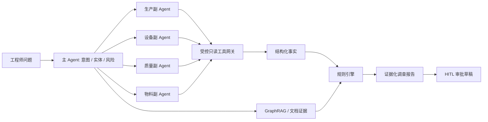

# Architecture Notes

## Logical flow

## Demo 与真实生产系统的边界

| 能力 | Demo | 生产化方向 |
|---|---|---|
| 数据 | 合成 JSON | MySQL / Neo4j / Milvus / Redis |
| 工具 | 本地模拟函数 | MCP 网关 + MES/QMS/EAM/WMS 适配器 |
| 模型 | 规则化模拟路由 | Qwen / vLLM / 结构化输出约束 |
| 图谱 | 静态路径 | 参数化 Cypher 只读模板 |
| 写操作 | 浏览器模拟确认 | 独立事务服务 + RBAC + 幂等 + 审计 |
| 可观测性 | trace_id / latency | OpenTelemetry + Prometheus + Grafana |

## 关键工程取舍

1. 让规则处理确定性判断，让模型处理语义理解和计划生成。
2. 让副 Agent 返回结构化证据，不直接返回不可验证的长文本。
3. 让高风险动作默认停在草稿状态，人工确认后才进入写链路。
4. 让每次调查都携带 trace_id、工具耗时和引用来源，支持复盘。
